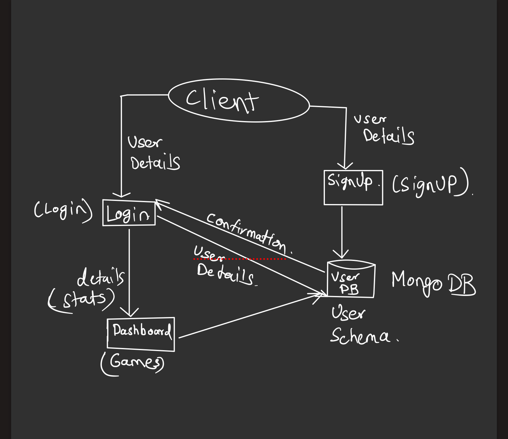

# Rock Paper Scissors Game 🗿📃✂️

This project is a web-based implementation of the classic Rock Paper Scissors game. Users can log in, sign up, and play against the computer.

## Technologies Used 💻

- **Frontend**: React.js, React Router v6, Axios
- **Backend**: Node.js, Express.js, MongoDB
- **Authentication**: JSON Web Tokens (JWT) 🔑
- **Styling**: CSS 🎨

## Features 🚀

- User authentication (login and signup) 🚪
- Play against the computer 🤖
- View total wins, losses, and draws 📊
- Responsive design for mobile and desktop 📱💻

## Getting Started 🏁

### Prerequisites 📋

- Node.js and npm/yarn installed on your machine 🖥️
- MongoDB instance (local or remote) 📦

### Installation ⚙️

1. Clone the repository:
   ```
   git clone https://github.com/your-username/rock-paper-scissors.git
   ```

2. Navigate to the project directory:
   ```
   cd rock-paper-scissors
   ```

3. Install dependencies:
   ```
   npm install
   # or
   yarn install
   ```

4. Set up environment variables in a `.env` file:
   ```
   PORT=8000
   MONGODB_URI=your-mongodb-uri
   JWT_SECRET=your-secret-key
   ```

### Running the Application ▶️

1. Start the backend server:
   ```
   node app.js
   ```

2. Start the frontend development server:
   ```
   npm start
   # or
   yarn start
   ```

3. Open `http://localhost:3000` in your browser to view the application.


## Database Schema 📊

### User Collection

```json
{
  "_id": "ObjectId (automatically generated)",
  "username": "String (unique, required)",
  "password": "String (hashed, required)",
  "name": "String (required)",
  "wins": "Number (default: 0)",
  "losses": "Number (default: 0)",
  "draws": "Number (default: 0)"
}
```

## Architecture Diagram 📊

